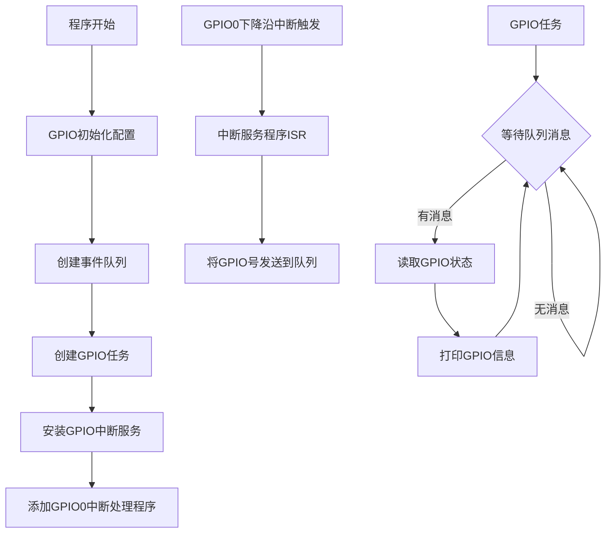

```mermaid
graph TD
    A[程序开始] --> B[GPIO初始化配置]
    B --> C[创建事件队列]
    C --> D[创建GPIO任务]
    D --> E[安装GPIO中断服务]
    E --> F[添加GPIO0中断处理程序]
    
    %% 中断处理流程
    G[GPIO0下降沿中断触发] --> H[中断服务程序ISR]
    H --> I[将GPIO号发送到队列]
        %% 任务处理流程
    J[GPIO任务] --> K{等待队列消息}
    K -->|有消息| L[读取GPIO状态]
    L --> M[打印GPIO信息]
    M --> K
    K -->|无消息| K
```
